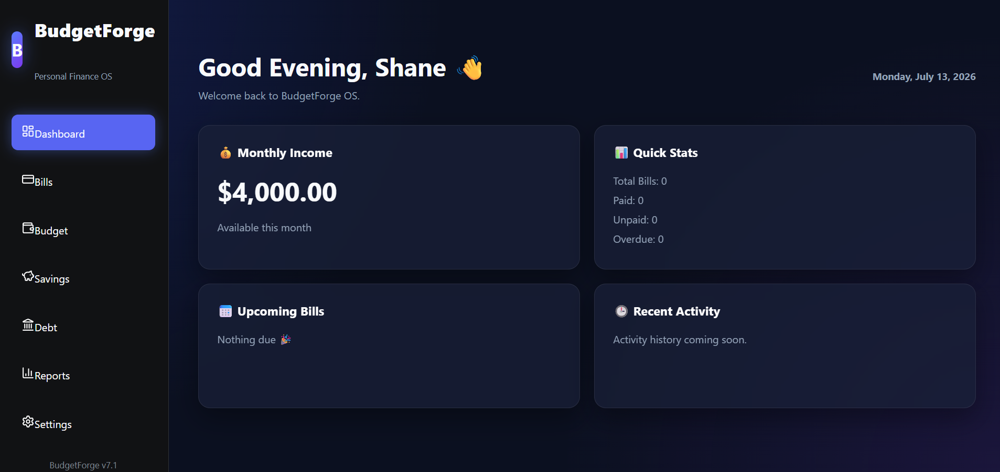
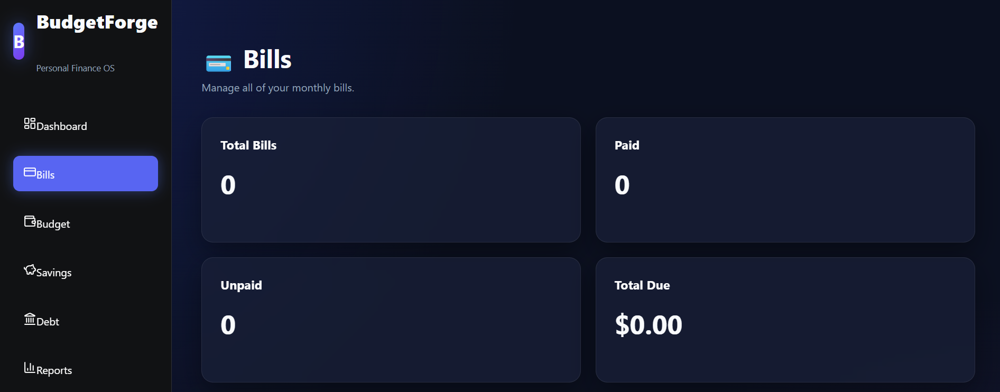
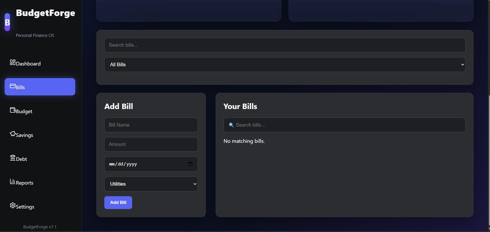
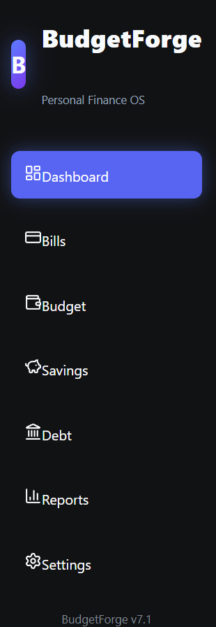

# 💰 BudgetForge OS

A modern personal finance dashboard built with **React**, **Vite**, and a desktop-inspired interface.

BudgetForge OS helps users organize bills, manage budgets, track savings goals, manage debt, back up their financial data, and visualize personal finances through a fast, responsive workspace.

---

# 🌐 Live Demo

🚀 **Live Application**

https://budget-forge.com

---

# ✨ Features

## 🏠 Dashboard

- Personalized greeting
- Monthly Income Widget
- Budget Utilization Meter
- Spending by Category Analytics
- Interactive Doughnut Chart
- Quick Statistics
- Upcoming Bills
- Recent Activity
- Responsive Widget Layout

---

## 💳 Bills Workspace

- Add Bills
- Delete Bills
- Mark Bills as Paid
- Live Search
- Paid / Unpaid Filters
- Bills Summary Widgets
- Total Due Calculation
- Color-coded Bill Status

---

## 🏦 Savings Goals

- Create unlimited savings goals
- Deposit funds
- Withdraw funds
- Edit savings goals
- Delete savings goals
- Live progress tracking
- Savings Overview dashboard
- Completion percentage
- Remaining balance calculation
- Local Storage persistence
- Reusable BudgetForge Modal

---

## 💳 Debt Management

- Create unlimited debt accounts
- Record debt payments
- Edit debt accounts
- Delete debt accounts
- Debt Overview dashboard
- Monthly minimum payment tracking
- Average APR calculation
- Balance tracking
- Local Storage persistence
- Reusable BudgetForge Modal

---

## 💾 Backup & Restore

- Export complete BudgetForge backups
- Restore backups from JSON
- Versioned backup format
- Automatic timestamped backup files
- Full Local Storage backup
- Cross-device migration
- Backup validation before restore

---

## 📊 Analytics

- Spending by Category
- Interactive Doughnut Chart
- Budget Utilization Meter
- Monthly Spending Overview
- Savings Progress Tracking
- Debt Overview
- Category Analysis

---

## ⌨️ Command Palette

- Ctrl + K
- Instant Navigation
- Keyboard Navigation
- Arrow Keys
- Enter to Launch
- Live Search
- Modular Command Architecture

---

## 📱 Mobile Experience

- Responsive Dashboard
- Mobile Header
- Mobile Navigation Drawer
- Responsive Widgets
- Optimized Mobile Layout

---

## 🎨 User Experience

- Aurora Theme
- Glassmorphism Interface
- Responsive Design
- Toast Notifications
- Reusable Modal System
- Command Palette
- Desktop-inspired Interface
- Local Storage Persistence

---

# ⚙️ Built With

- React 19
- React Hooks
- React Router
- Vite
- Recharts
- Lucide React
- CSS3
- Local Storage API

---

# 📸 Screenshots

## 🏠 Dashboard



---

## 💳 Bills Workspace



---

## 📊 Bills Dashboard



---

## 🎨 Sidebar



---

## 💳 Debt Management

*(Screenshot coming soon)*

---

## 💾 Backup & Restore

*(Screenshot coming soon)*

---

# 🚀 Current Features

- ✅ Dashboard Workspace
- ✅ Bills Management
- ✅ Budget Overview
- ✅ Savings Goals (Full CRUD)
- ✅ Debt Management (Full CRUD)
- ✅ Backup & Restore
- ✅ JSON Data Export
- ✅ JSON Data Import
- ✅ Spending Analytics
- ✅ Interactive Doughnut Chart
- ✅ Budget Utilization Meter
- ✅ Debt Overview Dashboard
- ✅ Savings Overview Dashboard
- ✅ Command Palette
- ✅ Keyboard Navigation
- ✅ Reusable Modal System
- ✅ Mobile Responsive Design
- ✅ Toast Notifications
- ✅ React Router Navigation
- ✅ Local Storage Persistence
- ✅ GitHub Version History

---

# 🎯 Current Release

## Version 18.0

Latest additions include:

- 💾 Backup & Restore
- 📤 Export BudgetForge Data
- 📥 Import BudgetForge Backups
- 🗂 Versioned JSON Backups
- 🛡 Backup Validation
- 🔄 Automatic Restore
- 🌍 Cross-device Migration

---

# 🛣️ Roadmap

## Version 18.1

- 🏔 Snowball Payoff Strategy
- 🏔 Avalanche Payoff Strategy
- ⭐ Recommended Debt to Pay Next

---

## Version 19

- 📅 Calendar View
- 🔔 Bill Reminders
- 📆 Upcoming Payment Timeline

---

## Version 20

- 📈 Financial Trends
- 📊 Monthly Spending History
- 💹 Savings Growth Charts

---

## Version 21

- ☁️ Cloud Sync
- 🔐 User Accounts
- 📱 Multi-device Synchronization

---

# 🛠️ Getting Started

Clone the repository

```bash
git clone https://github.com/river-log/BudgetForge.git
```

Navigate into the project

```bash
cd BudgetForge
```

Install dependencies

```bash
npm install
```

Run the development server

```bash
npm run dev
```

Build for production

```bash
npm run build
```

---

# 📜 Changelog

See **CHANGELOG.md** for the complete version history.

---

# 👨‍💻 Authors

**Shane Edsall**

**&**

**Future wife, Jorgette Ward**

Built with ❤️ using React, Vite, and modern web technologies.

---

# ⭐ Project Status

**BudgetForge OS** is actively under development.

Current development focuses on expanding BudgetForge into a complete personal finance platform with budgeting, savings, debt management, analytics, secure backup & restore, and future cloud synchronization.